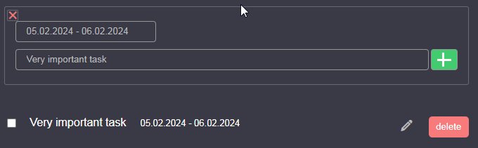

#  React Todo App


   


## Description

Introducing a React Todo App, a powerful and intuitive task management tool designed to enhance your productivity. This feature-rich application goes beyond basic to-do lists, offering dynamic date filtering, completed tasks tracking, and a visually appealing Gantt chart for comprehensive task overview.


## Reference
**[Watch React Todo App on GitHub Pages][gh-pages]**

&#13;
&#13;

## Build details

**Node version:** `v18.12.1`

**Dependencies:**
```
  "@testing-library/jest-dom": "^5.17.0",
  "@testing-library/react": "^13.4.0",
  "@testing-library/user-event": "^13.5.0",
  "@types/frappe-gantt": "^0.6.4",
  "@types/jest": "^27.5.2",
  "@types/node": "^16.18.68",
  "@types/react": "^18.2.45",
  "@types/react-dom": "^18.2.18",
  "air-datepicker": "^3.4.0",
  "frappe-gantt": "^0.6.1",
  "react": "^18.2.0",
  "react-datepicker": "^4.25.0",
  "react-dom": "^18.2.0",
  "react-scripts": "5.0.1",
  "sass": "^1.69.5",
  "typescript": "^4.9.5",
  "web-vitals": "^2.1.4"

  ```

  **Development dependencies:**

  ```
  "@babel/plugin-proposal-private-property-in-object": "^7.21.11",
  "@types/react-datepicker": "^4.19.5",
  "gh-pages": "^6.1.1"

  ```


  ## Commands

**Installation**
```
npm install
 ```
**Server start:**
```
npm run start
```
**Project build:**
```
npm run build
```
**Publish:**
```
npm run deploy
```


## Use

**Choosing date range to filter todos**


&#13;
&#13;
**Adding new tasks**



&#13;
&#13;
**Getting a bunch of tasks representation in gantt chart**


&#13;
&#13;

<details>
  <summary><b>Project folder structure</b></summary>
  <pre>
  src
    ├───assets
    │   ├───fonts
    │   └───images
    └───components
        ├───container
        ├───datepicker
        ├───filter
        ├───form
        ├───gantt-chart
        ├───helpers
        ├───title
        ├───todo
        └───todos
  </pre>
</details>
  

[gh-pages]: https://github.com/ArchiScript/ToDo-app__react__ts.git
